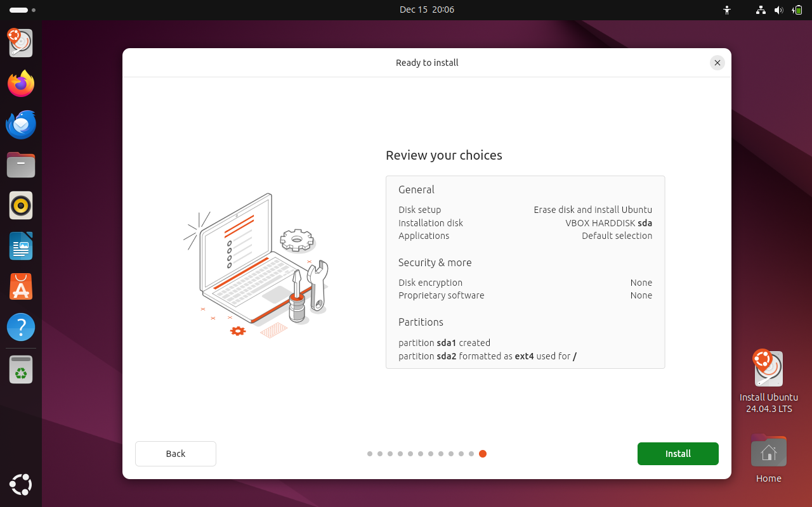
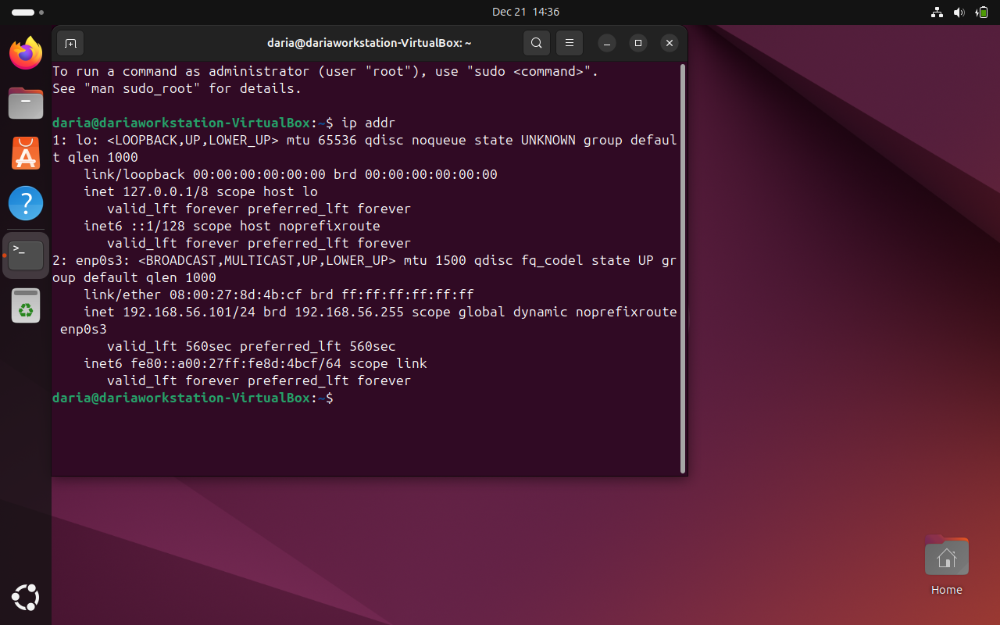
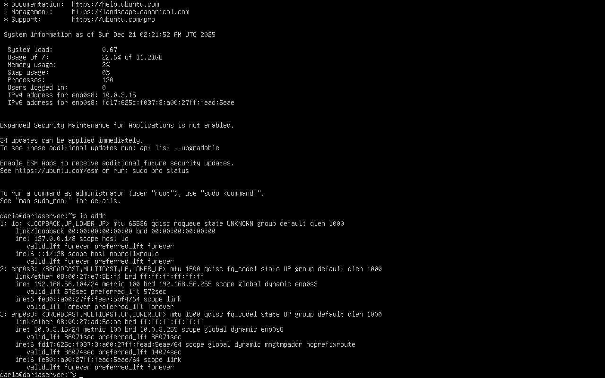
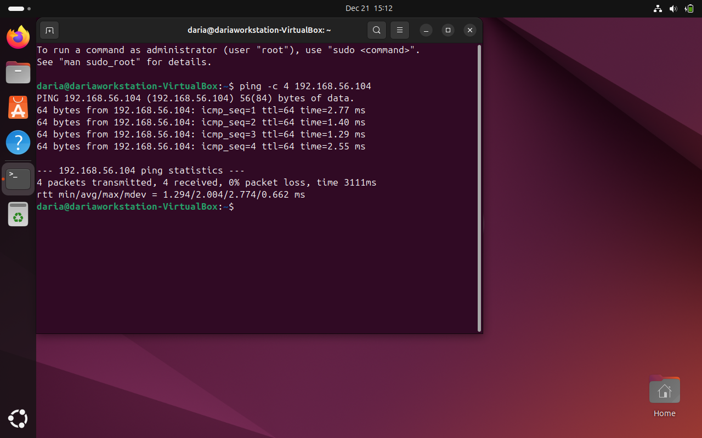
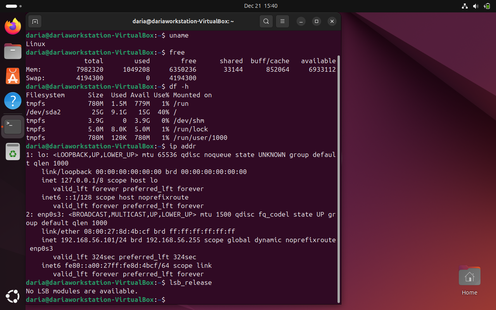
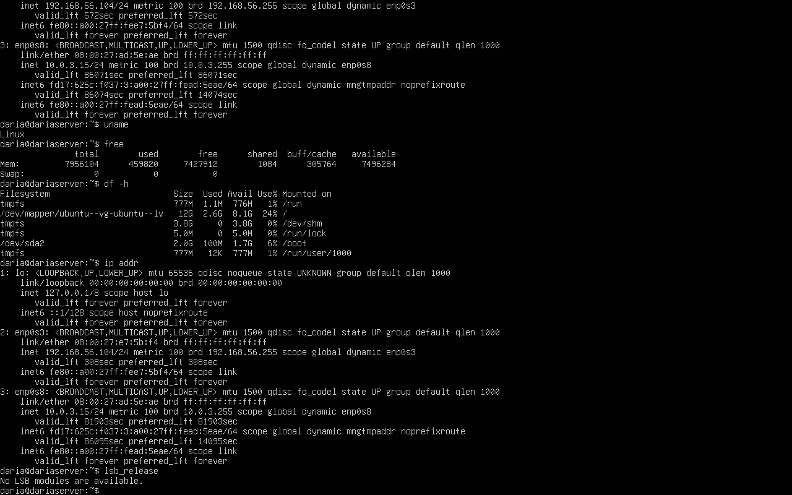

# System Planning and Distribution Selection
## Architecture
### Architecture requirements
Requirements of this assignment include a headless server without desktop environment, administered remotely through the workstation acting as an administrative access point. Regarding the workstation, following approaches are allowed: second Linux Desktop VM, my host machine with SSH client or a hybrid approach
#### Distribution Selection and Justification
Ubuntu Server was selected as the operating system for this project due to its extensive official documentation and Long-Term Support (LTS) release model. LTS releases provide predictable security updates and long-term stability, making Ubuntu Server well suited for server environments [3]. Additionally, the availability of comprehensive documentation and community resources supports effective troubleshooting and system administration during deployment and configuration [2].
#### Workstation approach choice and justification
An Ubuntu desktop virtual machine was selected as the workstation environment rather than using the host machine with SSH client. This approach allows isolation between system being under development and the host operating system. That reduces impact of potential configuration errors and security risks during deployment.
#### System Architecture Diagram

The system architecture diagram (Figure 1) demonstrates the connection between the server and the workstation. Administrative management is performed via SSH over a host-only network. This approach provides an isolated communication channel without exposing the virtual machines to external networks. While this isolation creates a secure environment suitable for controlled administrative tasks, it does not fully reflect real-world production deployments where servers typically communicate across wider networks. However, considering the scope of this assignment and its focus on initial configuration stages, the use of a host-only network is appropriate.

Additionally, server will connect to the internet through NAT connection, what allows it to use host machine's IP, rather than creating it's own [vm network source] and as a result provides additional security while system is being deployed. While NAT provides a secure method for outbound internet access, it also introduces certain limitations. Services running on the server are not directly reachable from external networks without explicit port forwarding, which can complicate testing of publicly accessible services. Additionally, NAT obscures the server’s real network identity behind the host machine, reducing visibility and control over inbound traffic. This trade-off is acceptable during early deployment phases, where security and controlled access are prioritised over external reachability.

Alternative approaches such as bridged networking were considered but rejected at this stage due to increased exposure to external threats and reduced isolation during deployment.

## Initial System Setup and Baseline Verification
In this section, both virtual machines are created and connected via a host-only network to enable private communication.

### Workstation
#### Virtual Machine creation

Figure 2. Installation parameters of workstation's virtual machine.

As shown in figure 2, base memory has been allocated at 8043MB and system was configured with three processors.This allocation was chosen to ensure sufficient resources for the workstation to operate smoothly during administrative tasks. As screenshot was taken after the Ubuntu installation, no IDE controller is shown. The Ubuntu Desktop ISO was used to install the operating system.

Additionally, a network adapter configured with a host-only network was added, in accordance with the system architecture shown in Figure 1.

#### Ubuntu installation

Figure 3. Initial Ubuntu configuration.

Figure 3 shows the initial Ubuntu configuration for the workstation. As shown in Figure 3, Ubuntu Desktop was installed using the default installation settings, with no additional applications selected during the installation process.

### Server
#### Virtual machine creation and Ubuntu Installation

Figure 4. Parameters of server's virtual machine.

The server virtual machine was configured in a similar way to the workstation virtual machine, with two key differences. Ubuntu Live Server ISO was used as the installation media via the IDE controller, and an additional network adapter was added for future NAT configuration, in accordance with the system architecture shown in Figure 1.

Figure 5. Headless linux server installation.

Figure 5 shows the successful installation of a headless Linux server. After installing Ubuntu Server using the Ubuntu Live Server ISO and rebooting the machine, the server was ready for further configuration.

## Host-only network configuration
In this part host-only network is established between the workstation and the server. As we added host-only adapters while creating virtual machines, this step won't be shown in this phase.

### IP check
At first ip addr command was run on both: workstation and a server, to ensure that they are vissible on the network. The result for workstation is shown in the figure 6.

Figure 6. Result of calling ip addr on workstation.

As we can see in the figure 6, workstation's IP is 192.168.56.101/24, where /24 is a subnet mask (signifying that the first 3 octets of numbers are the network addres).

For the server results of calling ip addr shows figure 7.

Figure 7. Result of calling ip addr on the server.

On the screen above we can see that the server's IP address is 192.168.56.104/24. As the first three octets are the same as well as the subnet mask, we can see both machines are a part of the same network.

As it has been astablished that machines are on the same network, their ability to see eachother has been checked as shown on figure 8.

Figure 8. Pinging server from the workstation.

As we can see on figure 8, pinging server's IP address on the workstation resulted in transmiting data (4 packets send, 4 pacets recieved). This ICMP echo test proves that the network has been established and IP addressing is correct.

As openSHH / SHH hasn't been installed while installing Ubuntu, we can't remotely connect to the server yet. SHH setup as well as NAT network setup will be sone in the future phases.

## Baseline verification
For this part commands, namely: 'name', 'free', 'df -h', 'ip addr' and 'lsb_release' were run to verify the system baseline. Data received, will be used in the future phases to analyse the peformance of the system. Results of running said commands show figure 9 and figure 10.

Figure 9. Workstation's baseline system information.

Figure 10. Server's baseline system information.

### Baseline system analysis and information (based on the results shown in figures 9 and 10)

To establish the baseline and ensure that system has been configured with the sufficient resources for the assignment brief, results of running each of this commands will be analysed.

#### 'name'
The 'name' command verifies what operating system machine is running on. In both cases the output is Linux, what proofs that the operating system has been installed correctly, what complies with the initial arcitecture choices.

### 'free'
The 'free' command presents storage usage statistics, namely: used, free, and available memory, as well as swap usage.

As presented in above figures, there is a very low memory usage for the server, what is expected for a headless system. It proves that the system is currently idle and oparates efficiently. 

On the workstation, higher memory usage is observed, due to the presence of the graphical user interface. However, remaining memory is still sufficient to perform the requirements for this assignment.

### 'df -h'
The df -h command provides an overview of disk usage. The output shows mounted filesystems, their total size, used space, and available space.

Both machines show adequate free disk space, with relatively low usage after installation. This confirms that the allocated virtual disks are sufficient for the scope of this assignment and leave room for future package installations, logs, and configuration files

### 'ip addr'
The ip addr command was used to inspect network interfaces and assigned IP addresses.

Both the workstation and the server have been assigned IPv4 addresses in the 192.168.56.0/24 range on their host-only network interfaces. The shared subnet and matching subnet mask confirm that both machines are part of the same private network, enabling direct communication between them. This configuration is required for secure remote administration and testing without exposing the systems to external networks.

### 'lsb_release'
The lsb_release command was used to retrieve Linux distribution information. On both systems, the output confirms that Ubuntu is installed. This verifies consistency between the server and workstation environments and supports the earlier justification for choosing Ubuntu due to its documentation and long-term support model.
