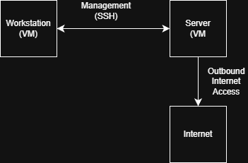
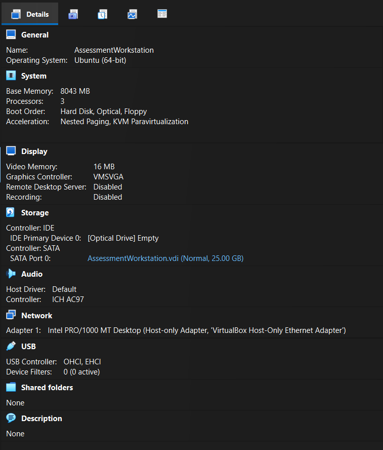

# System Planning and Distribution Selection
## Architecture
### Architecture requirements
Requirements of this assignment include a headless server without desktop environment, administered remotely through the workstation acting as an administrative access point. Regarding the workstation, following approaches are allowed: second Linux Desktop VM, my host machine with SSH client or a hybrid approach
#### Distribution Selection and Justification
Ubuntu Server was selected as the operating system for this project due to its extensive official documentation and Long-Term Support (LTS) release model. LTS releases provide predictable security updates and long-term stability, making Ubuntu Server well suited for server environments [3]. Additionally, the availability of comprehensive documentation and community resources supports effective troubleshooting and system administration during deployment and configuration [2].
#### Workstation approach choice and justification
An Ubuntu desktop virtual machine was selected as the workstation environment rather than using the host machine with SSH client. This approach allows isolation between system being under development and the host operating system. That reduces impact of potential configuration errors and security risks during deployment.
#### System Architecture Diagram

The system architecture diagram (Figure 1) demonstrates the connection between the server and the workstation. Administrative management is performed via SSH over a host-only network. This approach provides an isolated communication channel without exposing the virtual machines to external networks. While this isolation creates a secure environment suitable for controlled administrative tasks, it does not fully reflect real-world production deployments where servers typically communicate across wider networks. However, considering the scope of this assignment and its focus on initial configuration stages, the use of a host-only network is appropriate.

Additionally, server will connect to the internet through NAT connection, what allows it to use host machine's IP, rather than creating it's own [vm network source] and as a result provides additional security while system is being deployed. While NAT provides a secure method for outbound internet access, it also introduces certain limitations. Services running on the server are not directly reachable from external networks without explicit port forwarding, which can complicate testing of publicly accessible services. Additionally, NAT obscures the server’s real network identity behind the host machine, reducing visibility and control over inbound traffic. This trade-off is acceptable during early deployment phases, where security and controlled access are prioritised over external reachability.

Alternative approaches such as bridged networking were considered but rejected at this stage due to increased exposure to external threats and reduced isolation during deployment.

## Initial System Setup and Baseline Verification
In this section, both virtual machines are created and connected via a host-only network to enable private communication.

### Workstation
#### Virtual Machine creation

Figure 2. Installation parameters of workstation's virtual machine.

As shown in figure 2, base memory has been allocated at 8043MB and system was configured with three processors.This allocation was chosen to ensure sufficient resources for the workstation to operate smoothly during administrative tasks. As screenshot was taken after the Ubuntu installation, no IDE controller is shown. The Ubuntu Desktop ISO was used to install the operating system.

Additionally, a network adapter configured with a host-only network was added, in accordance with the system architecture shown in Figure 1.

#### Ubuntu installation
