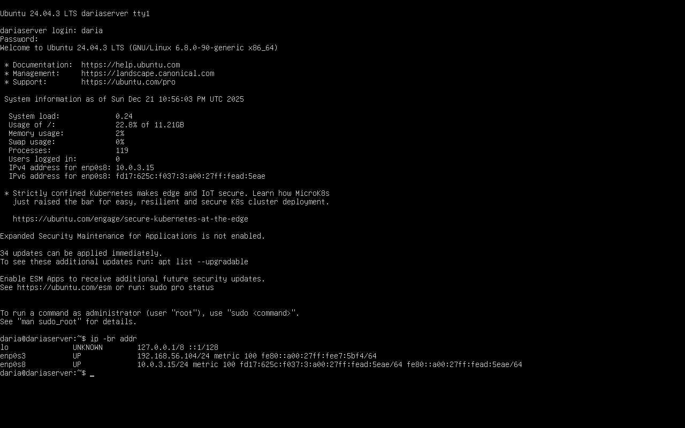
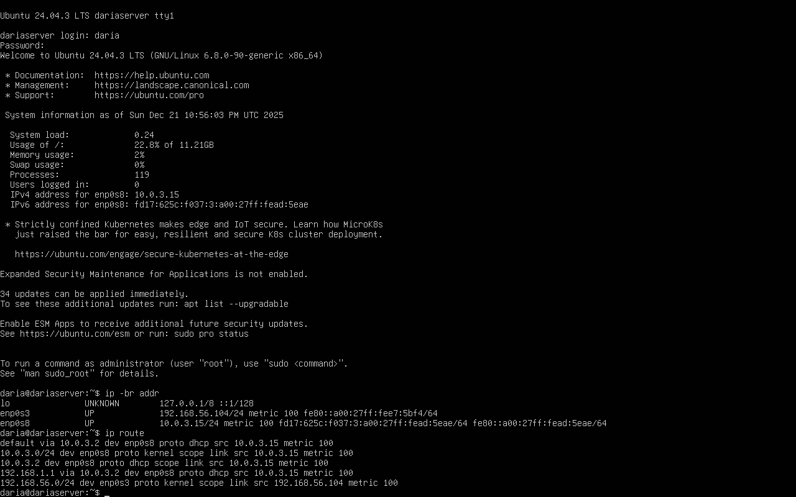
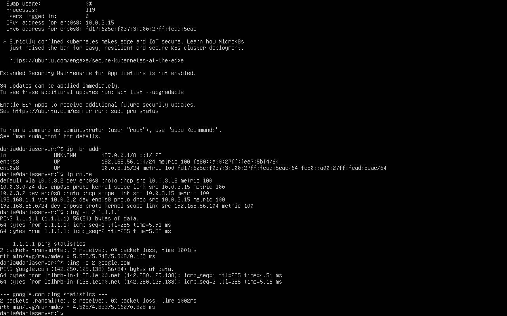
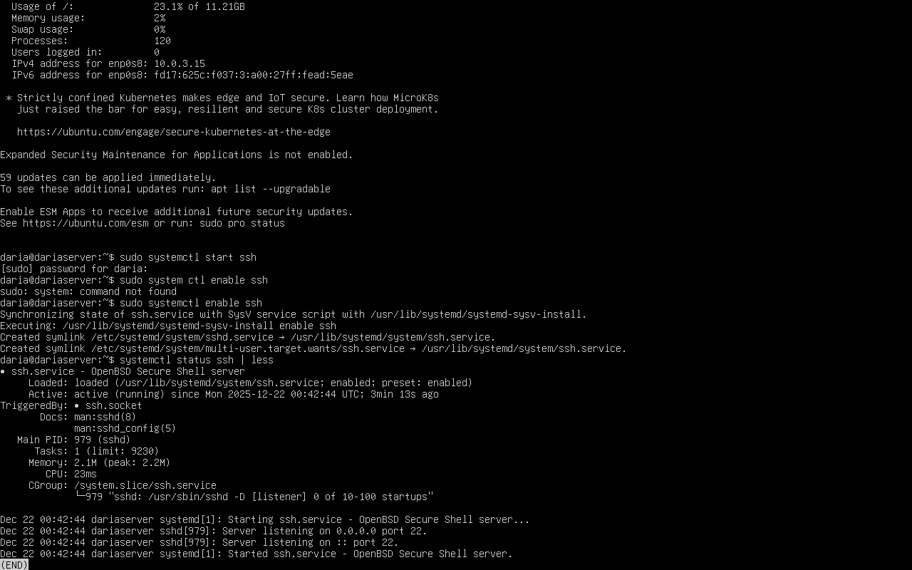

# Initial System Configuration and Secure Remote Administration
## Objective
The objective of this phase is to establish secure remote administration of the server system by verifying network connectivity, installing and configuring SSH, and implementing foundational operating system security controls. This phase transitions the system from initial local access to controlled remote management via SSH, ensuring that administrative access is secure, auditable, and aligned with industry best practices.

All configuration changes are performed incrementally and verified at each stage to minimise the risk of misconfiguration or loss of administrative access [1].

## Network Connectivity Verification (NAT and Host-Only Configuration)
Prior to installing additional services, outbound network connectivity was required to support package and system updates. The server was configured with two network interfaces:
- A host-only interface for internal communication and administrative access.
- A NAT interface to provide outbound internet connectivity.

Figure 1. Confirmation of both interfaces (host-only and NAT) and IP's in server.

Network interface inspection confirmed that both interfaces were active with correctly assigned IP addresses. The host-only interface was assigned an address in the 192.168.56.0/24 subnet, while the NAT interface was assigned an address in the 10.0.3.0/24 subnet, as shown in figure 1. 'ip -br addr' instead of 'ip addr' as it provides quick overview (enough for the task), rather than detailed network information.

Figure 2. Confirmation that NAT is selected as default route (server).

Routing inspection confirmed that the NAT interface was selected as the default route for outbound traffic, ensuring that internet-bound packets were correctly routed via the NAT gateway rather than the host-only interface (Figure 2). This configuration prevents connectivity issues commonly encountered when multiple interfaces have equal routing priority [3].

Figure 3. ICMP and name resolution test (server).

Connectivity and DNS resolution were verified using ICMP and name resolution tests, confirming successful outbound connectivity and correct DNS configuration, as shown in figure 3.

## SSH Server Installation, Activation, and Verification
Secure Shell (SSH) was selected at the primary mechanism for remote administration due to its encrypted communication model and widespread adoption in server environments [2]. As SSH was not installed by default on the server system, the OpenSSH server package was installed using the system package manager.

Due to the volume of console output generated during package installation and limitations of the VirtualBox server console scrollback, screenshots of the installation process were not retained. However, installation was subsequently verified through service status inspection, confirming that SSH deamon (background process) was installed.

Following installation, initial service inspection revealed that the SSH deamon was present, but not actively running. On Ubuntu Server 24.04, SSH is configured by default to support socket-based activation, meaning the SSH service is triggered on demand rather than continuously running. For the purpose of this assignment, and to ensure predictable availability for remote administration, the SSH service was explicitly started and enabled to launch automatically boot.

All this process is presented in figure 4.

Figure 4. SSH installation confirmation.
