# Initial System Configuration and Secure Remote Administration
## Objective
The objective of this phase is to establish secure remote administration of the server system by verifying network connectivity, installing and configuring SSH, and implementing foundational operating system security controls. This phase transitions the system from initial local access to controlled remote management via SSH, ensuring that administrative access is secure, auditable, and aligned with industry best practices.

All configuration changes are performed incrementally and verified at each stage to minimise the risk of misconfiguration or loss of administrative access [1].

## Network Connectivity Verification (NAT and Host-Only Configuration)
Prior to installing additional services, outbound network connectivity was required to support package and system updates. The server was configured with two network interfaces:
- A host-only interface for internal communication and administrative access.
- A NAT interface to provide outbound internet connectivity.

Figure 1. Confirmation of both interfaces (host-only and NAT) and IP's in server.

Network interface inspection confirmed that both interfaces were active with correctly assigned IP addresses. The host-only interface was assigned an address in the 192.168.56.0/24 subnet, while the NAT interface was assigned an address in the 10.0.3.0/24 subnet, as shown in figure 1. 'ip -br addr' instead of 'ip addr' as it provides quick overview (enough for the task), rather than detailed network information.

Figure 2. Confirmation that NAT is selected as default route (server).

Routing inspection confirmed that the NAT interface was selected as the default route for outbound traffic, ensuring that internet-bound packets were correctly routed via the NAT gateway rather than the host-only interface (Figure 2). This configuration prevents connectivity issues commonly encountered when multiple interfaces have equal routing priority [3].

Figure 3. ICMP and name resolution test (server).

Connectivity and DNS resolution were verified using ICMP and name resolution tests, confirming successful outbound connectivity and correct DNS configuration, as shown in figure 3.

## SSH Server Installation, Activation, and Verification
Secure Shell (SSH) was selected at the primary mechanism for remote administration due to its encrypted communication model and widespread adoption in server environments [2]. As SSH was not installed by default on the server system, the OpenSSH server package was installed using the system package manager.

Due to the volume of console output generated during package installation and limitations of the VirtualBox server console scrollback, screenshots of the installation process were not retained. However, installation was subsequently verified through service status inspection, confirming that SSH deamon (background process) was installed.

Following installation, initial service inspection revealed that the SSH deamon was present, but not actively running. On Ubuntu Server 24.04, SSH is configured by default to support socket-based activation, meaning the SSH service is triggered on demand rather than continuously running. For the purpose of this assignment, and to ensure predictable availability for remote administration, the SSH service was explicitly started and enabled to launch automatically boot.

All this process is presented in figure 4.

Figure 4. SSH installation confirmation.

## Initial SSH Connection from Workstation
After confirming that the SSH service was operational, a remote connection was  established from the workstation to the server using the host-only network interface, what is shown in figure 5.

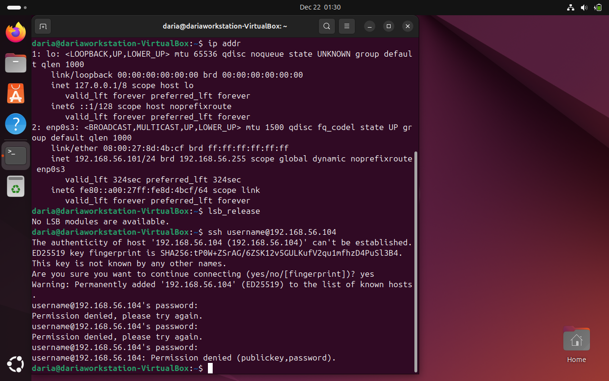

Figure 5. Established connection from workstation to the server.

From this point onward, all further configuration tasks were performed remotely via SSH, in accordance, as required in the assessment brief.

## User and Privilege Management
To reduce the risk associated with direct root access, a dedicated non-root administrative user was created. This approach follows the principle of least priviledge, ensuring that administrative tasks can be performed without routinely operating the root user, and as a result limiting the potential impact of accidental misconfiguration or credential compromise [1], [4].
The new administrative user was granted elevated privileges through controlled membership of the 'sudo' group. Group membership was verified to confirm correct privilege assignment, and remote access was subsequently tested to ensure taht administrative tasks could be performed securely without relying on the original user account.
Figures 6, 7 and 8 show respectively: evidence of user creation, evidence of priviledge assignment, evidence showing membership of the sudo group.

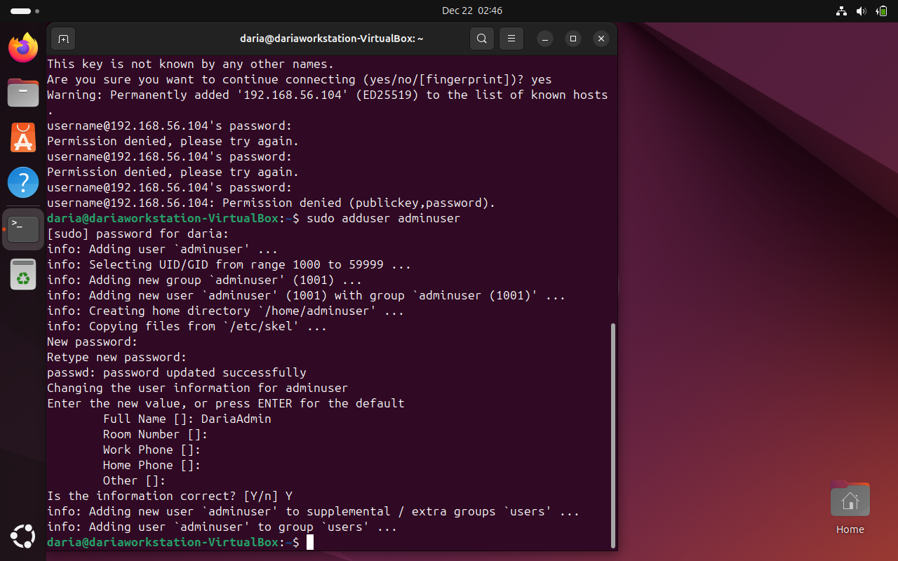

Figure 6. User creation.

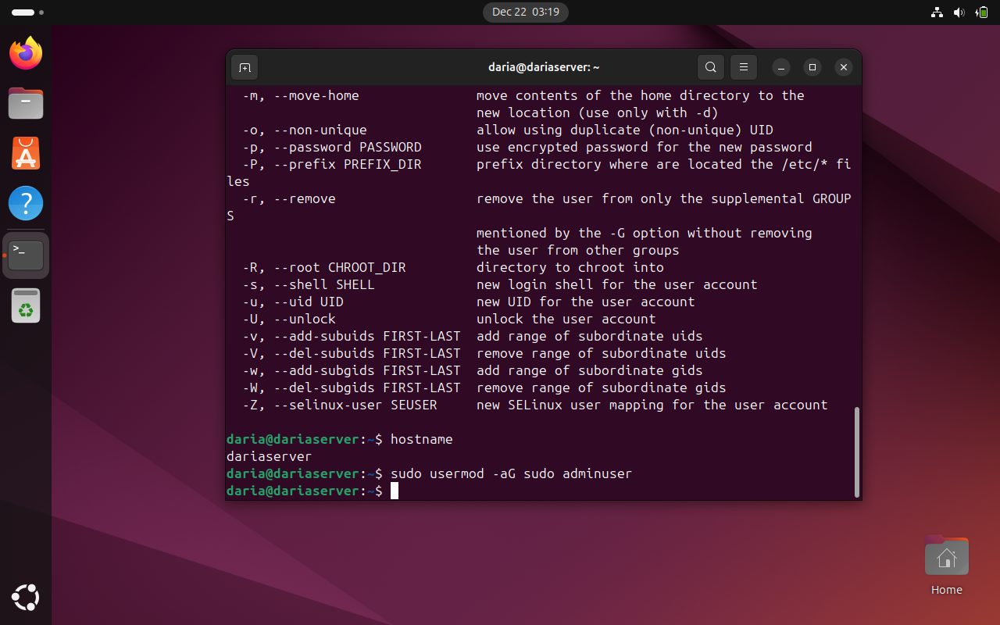

Figure 7. User privileges.

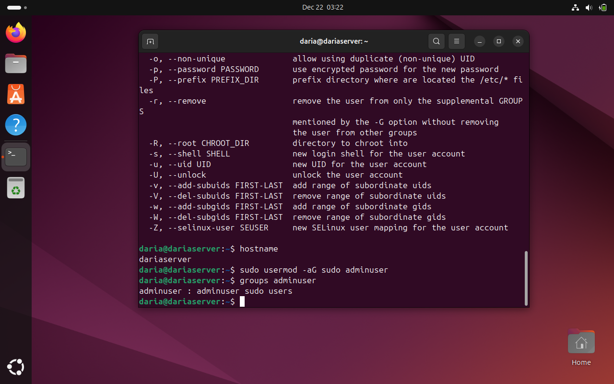

Figure 8. Membership of the sudo group.

## User authentication hardening
Following successful remote access and user setup, SSH authentication was hardened to reduce exposure to common attack vectors. Public key authentication was selected in preference to password-based authentication due to its resistance to brute-force attacks and credential guessing [4].

Key-based authentication was configured and verified before applying restrictive SSH configuration changes. This staged approach ensured that administrative access was not lost during the hardening process. Once verified, direct root login and password authentication were disabled within the SSH configuration, significantly strengthening remote access security.

Steps are presented in the screenshots below:

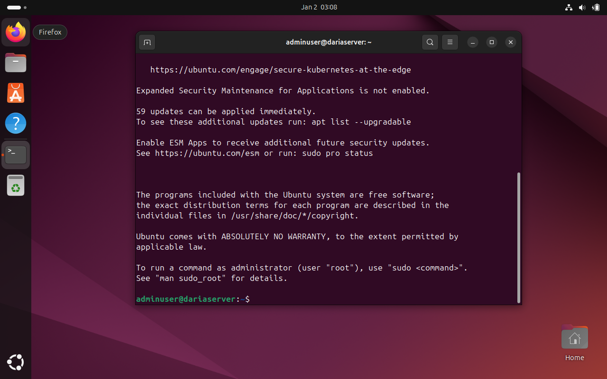

Figure 9. Figure 9. Password based login to the server as an adminuser - verification

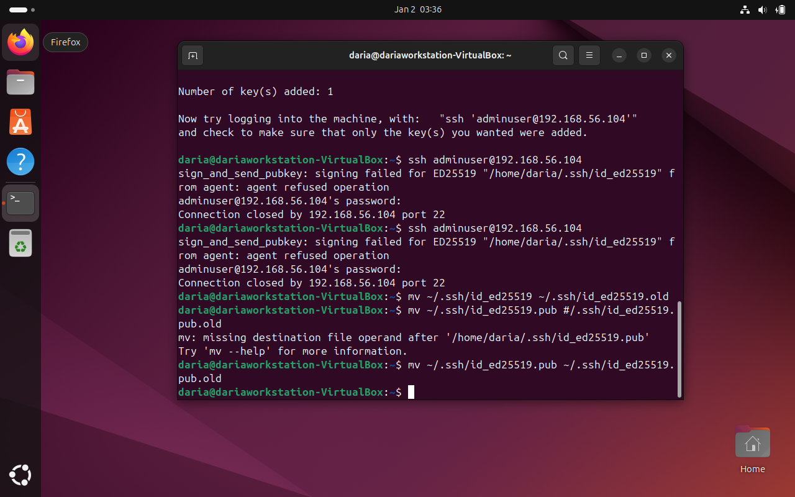

Figure 10. Old keys archived.

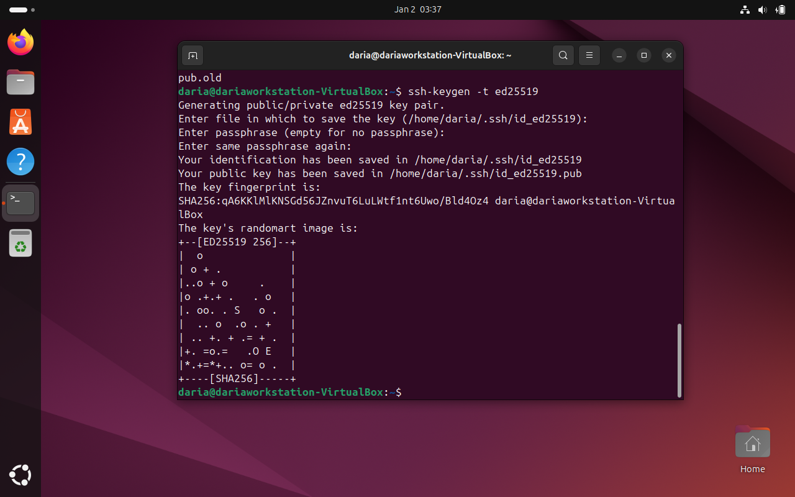

Figure 11. New keys generated.

As keys were generated before, but no screenshots taken, old files were archived (Figure 10) and ne generated (Figure 11) to show the proccess.

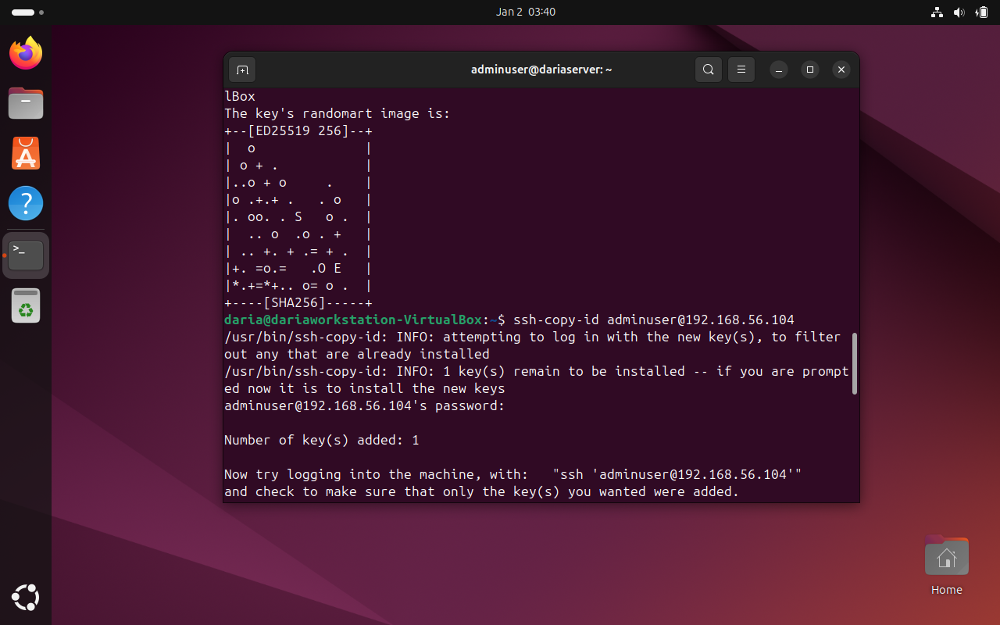

Figure 12. Key file copied to the server.

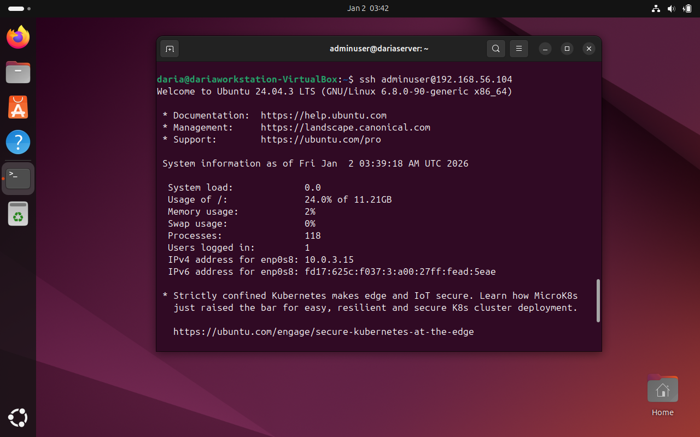

Figure 13. Veryfing successful key-based login.

After veryfying that SSH key-based login works, configuration file is edited (Figures 14 and 15).

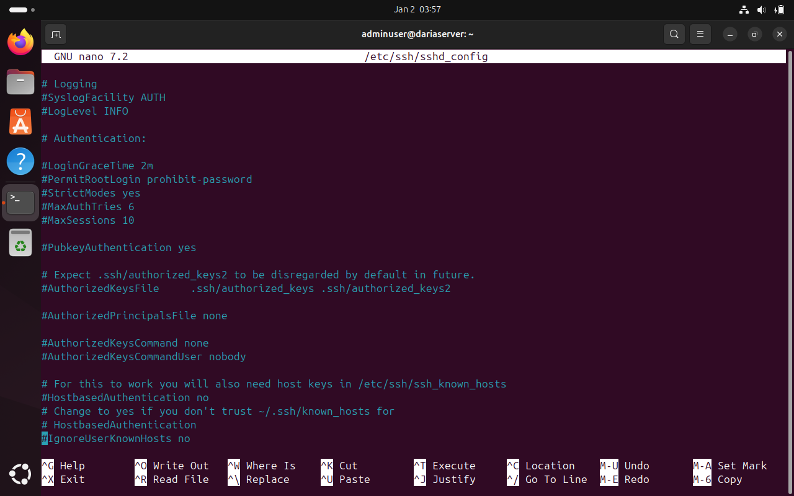

Figure 14. Configuration file before edits.

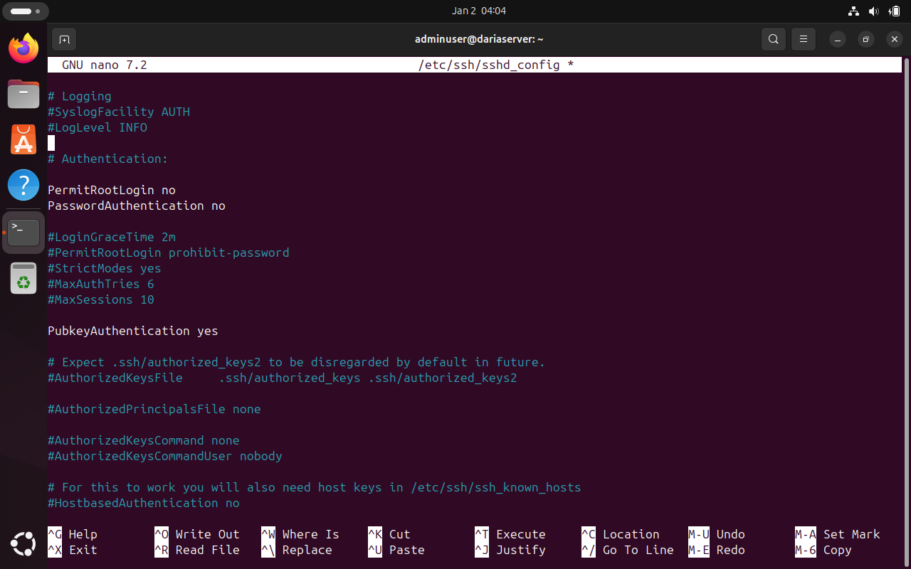

Figure 15. Configuration file after edits.

After restarting SSH (figure 16) key-based login was successful (Figure 17).

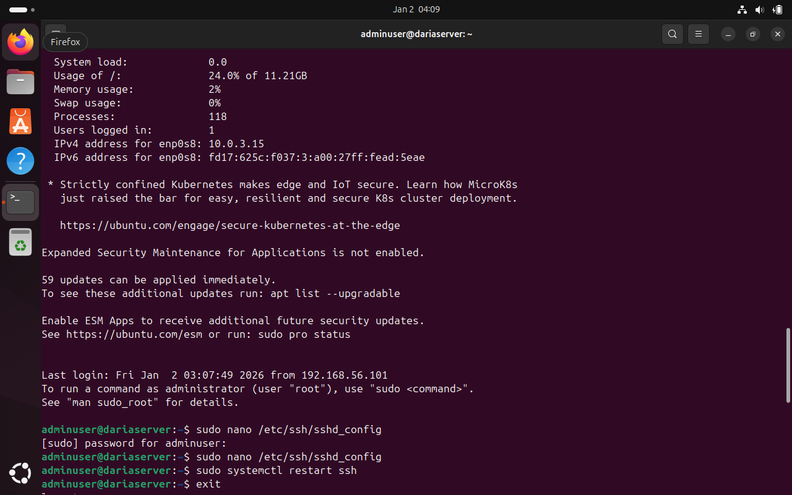

Figure 16. SSH restart

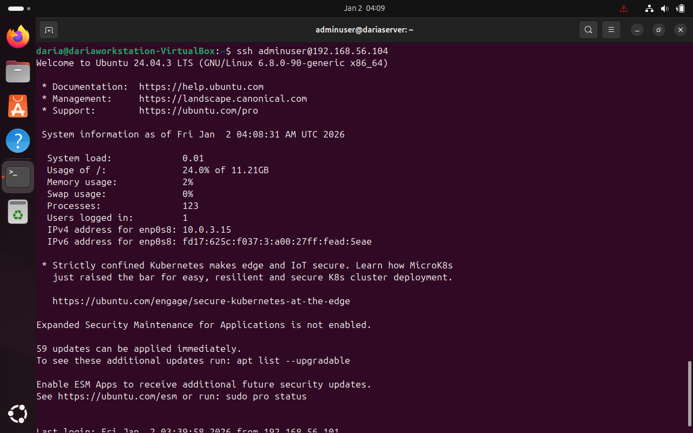

Figure 17. Successful key-based login.

## Firewall configuration
To further reduce the attack surface of the server, a host-based firewall was configured using Uncomplicated Firewall (UFW). UFW provides a simplified interface for managing iptables rules and is suitable for baseline server security on Ubuntu systems.

The firewall configuration followed the principle of default deny, where all unsolicited inbound traffic is blocked unless explicitly allowed. This approach ensures that only essential services remain accessible. Before enabling the firewall, SSH access was explicitly allowed (Figure 18)

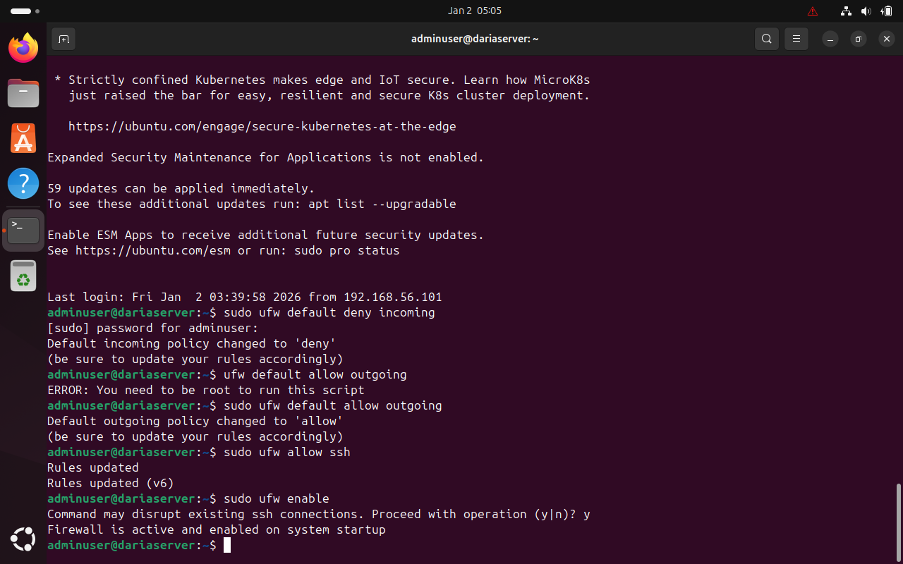

Figure 18. Firewall configuration.

Firewall status was verified to confirm that the rules were applied correctly (Figure 19).

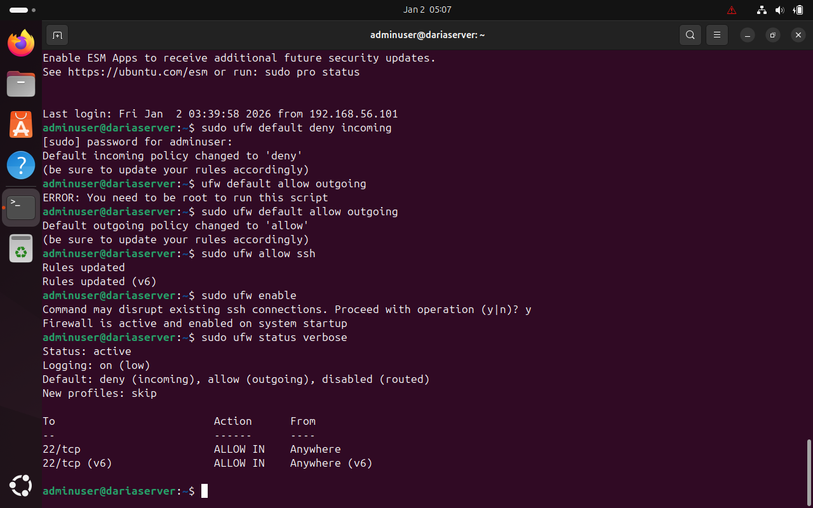

Figure 19. Firewall status after configuration.

## Summary
Phase 4 focused on securing remote access and hardening network-level controls on the server. Secure Shell (SSH) was configured to use key-based authentication, eliminating reliance on password-based logins and preventing direct root access. This significantly reduced the risk of brute-force and credential-based attacks.

User privilege management ensured that administrative access was restricted to a non-root user with controlled sudo privileges. This aligns with the principle of least privilege and improves accountability.

Finally, a host-based firewall was deployed using UFW to restrict network access to essential services only. By enforcing a default-deny policy and explicitly allowing SSH traffic, the server’s external attack surface was minimized while maintaining secure remote administration.

Together, these measures establish a strong and secure foundation for subsequent security, performance, and auditing phases of the system configuration.

## References
[1] M. Nemeth, E. Snyder, T. Hein, B. Whaley, and D. Mackin, UNIX and Linux System Administration Handbook, 5th ed. Pearson, 2018.

[2] D. Barrett, R. Silverman, and R. Byrnes, SSH, The Secure Shell: The Definitive Guide, 2nd ed. O’Reilly Media, 2005.

[3] Canonical Ltd., Ubuntu Server Documentation. [Online]. Available: https://ubuntu.com/server/docs [Accessed: 22-Dec-2025]

[Accessed: 21-Dec-2025].

[4] National Institute of Standards and Technology (NIST), Security and Privacy Controls for Information Systems and Organizations, NIST SP 800-53 Rev. 5, 2020. [Online]. Available: https://csrc.nist.gov/pubs/sp/800/53/r5/upd1/final [Accessed: 02-Jan-2026]
