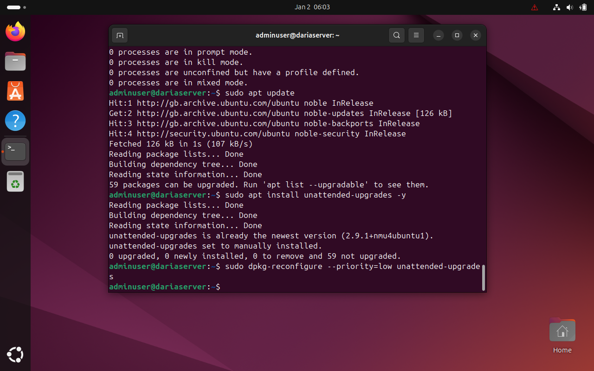
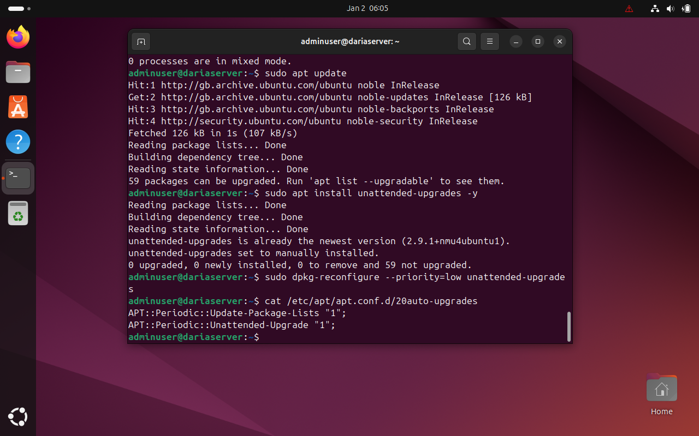
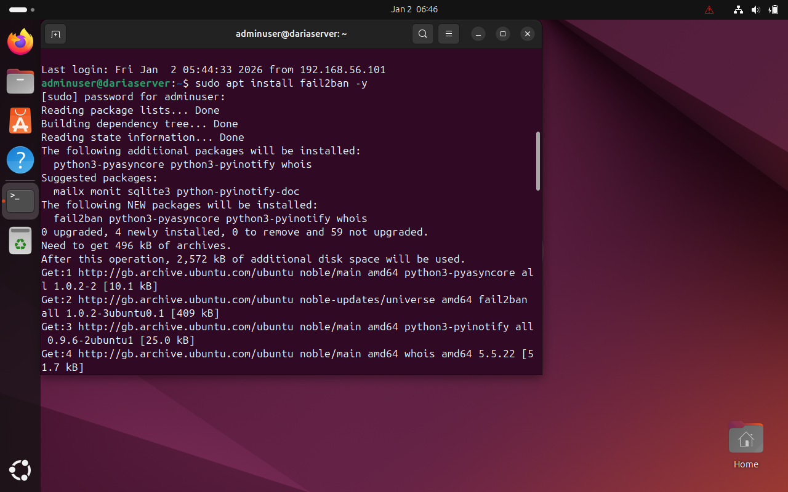
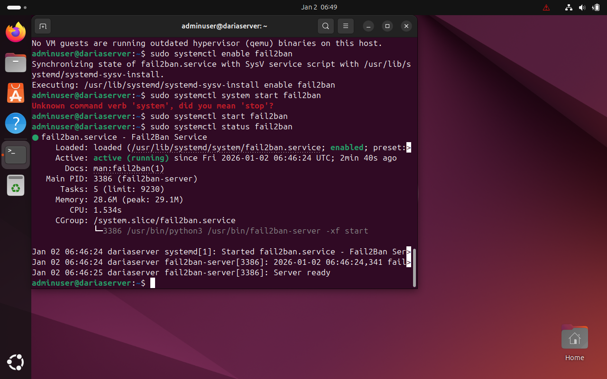
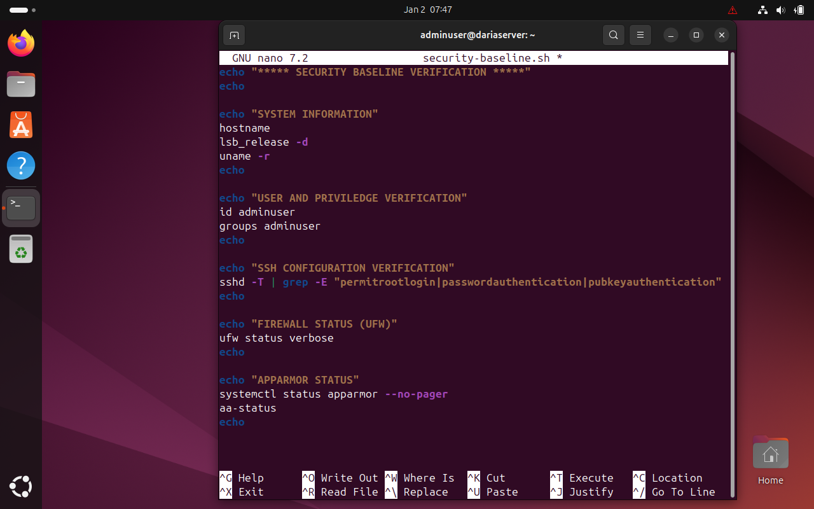
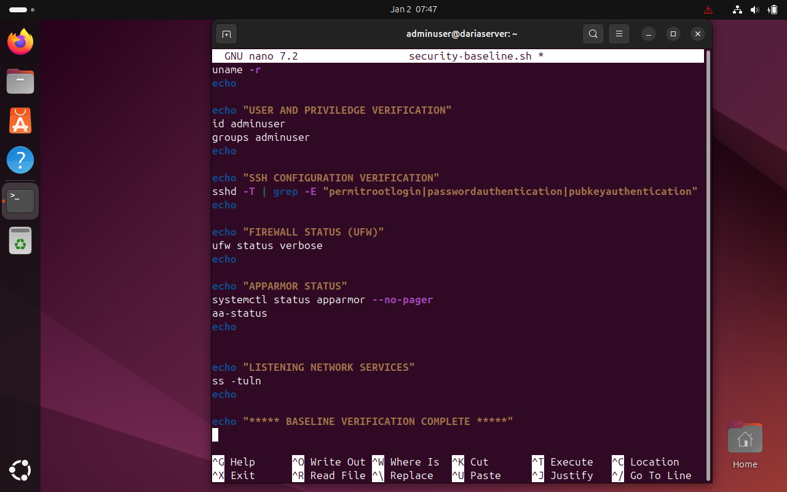
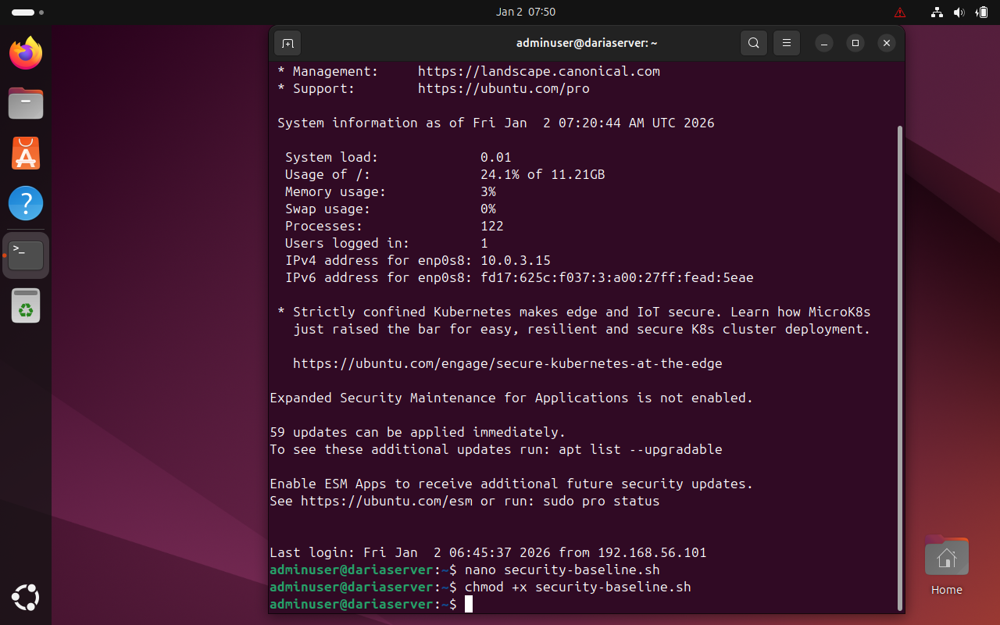
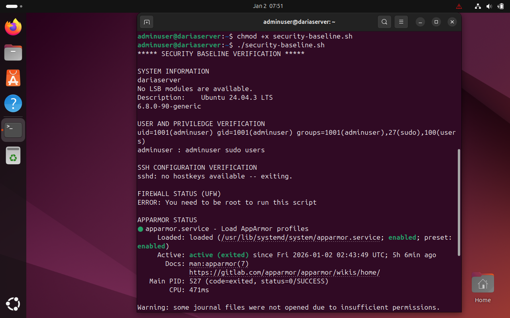
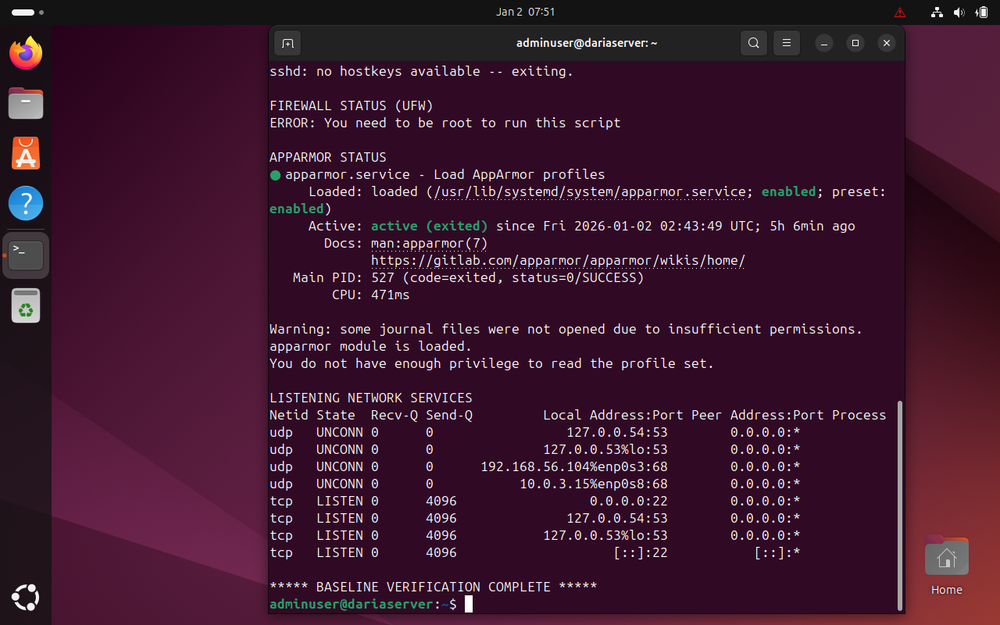

# Advanced Security and Monitoring Ifrastructure
## Mandatory Access Control with AppArmor
To extend system security beyond traditional discretionary access controls, mandatory access control (MAC) was enforced using AppArmor, which is enabled by default on Ubuntu Server. AppArmor restricts application capabilities through predefined security profiles, limiting the potential damage caused by compromised services or misbehaving processes [1][4].

The service status and profile enforcement mode were verified to ensure that AppArmor was actively protecting the system rather than operating in a passive state (Figures 1 and 2)

Figure 1. Evidence showing AppArmor service is active.

Figure 2. Figure 2. Evidence confirming loaded profiles and enforcing mode.

## Automated Security Updates
To reduce exposure to publicly disclosed vulnerabilities, automatic security updates were configured using the unattended-upgrades mechanism (Figure 3). This ensures that critical security patches are applied promptly without manual intervention, aligning with recommended best practices for server maintenance [1][4].

Configuration files were reviewed to confirm that security repositories were enabled and scheduled for automatic execution (Figure 4). 

Figure 3. Evidence showing unattended-upgrades configuration prompt.

Figure 4. Evidence confirming automatic security updates are enabled.

## Intrusion Prevention with Fail2Ban
To protect against brute-force login attempts and repeated authentication failures, Fail2Ban was deployed as an intrusion prevention mechanism. Fail2Ban actively monitors authentication logs and dynamically blocks offending IP addresses, complemmenting the static firewall rules configured in Phase 4 [2][4], as shown in Figures 5 and 6.

The SSH jail was verified to confirm active protection of the remote administration service (Figure 7).

Figure 5. Fail2Ban installed.

Figure 6. Fail2Ban enabled and it's status

Figure 7. SSH jail active.

## Security Baseline and Verification Script
To improve auditability and ensure configuration consistency, a security baseline verification script was created. The script performs automated checks of key hardening measures implemented through the coursework, allowing rapid verification of system security posture and early detection of configuration drift.

Figure 8. Security baseline verification script (part 1)

Figure 9. Security baseline verification script (part 2)

Figure 10. Creating "security-baseline.sh" file and making it executable

Figure 11. Result of running the "security-baselie.sh" script (part 1)

Figure 12. Result of running the "security-baselie.sh" script (part 2)

## Remote Monitoring and Performance Preparation
