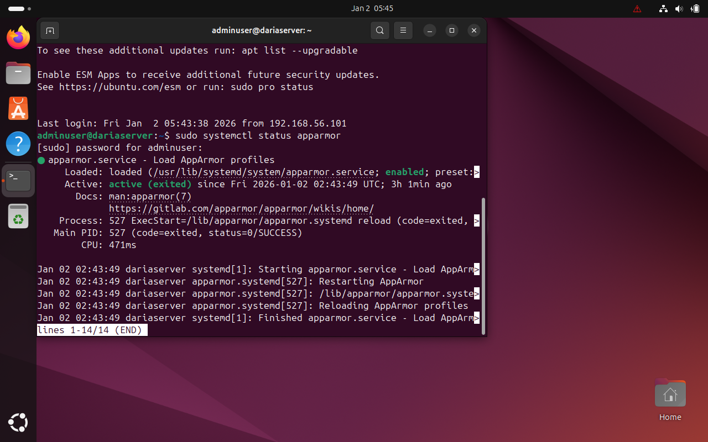
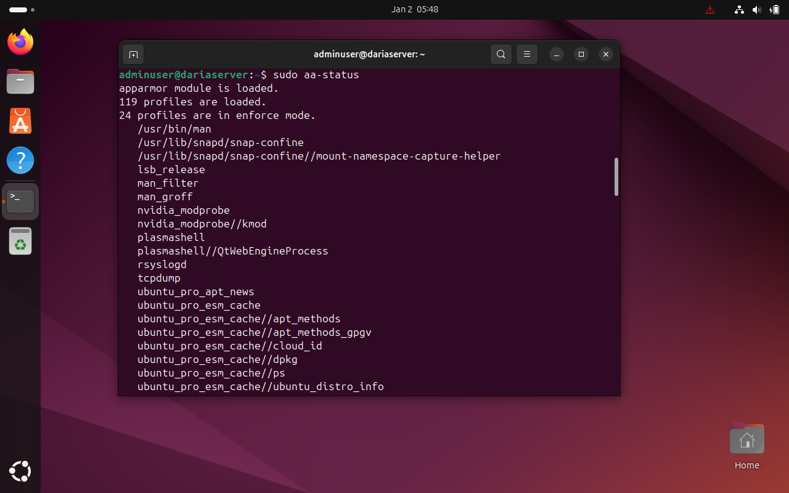

# Advanced Security and Monitoring Ifrastructure
## Mandatory Access Control with AppArmor
To extend system security beyond traditional discretionary access controls, mandatory access control (MAC) was enforced using AppArmor, which is enabled by default on Ubuntu Server. AppArmor restricts application capabilities through predefined security profiles, limiting the potential damage caused by compromised services or misbehaving processes [1][4].

The service status and profile enforcement mode were verified to ensure that AppArmor was actively protecting the system rather than operating in a passive state (Figures 1 and 2)

Figure 1. Evidence showing AppArmor service is active.

Figure 2. Figure 2. Evidence confirming loaded profiles and enforcing mode.

## Automated Security Updates
